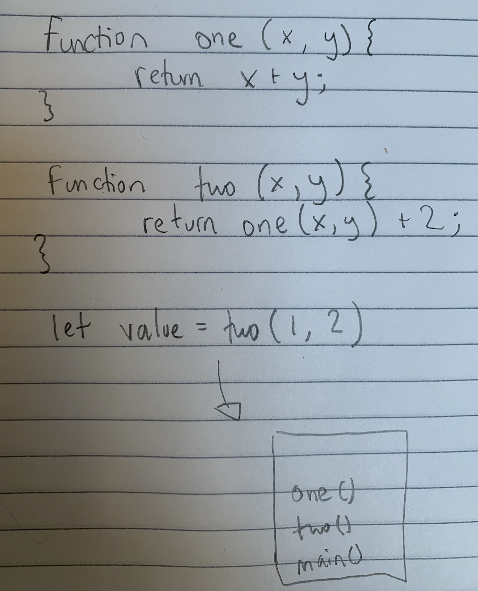

# Reading 10

## JavaScript Call Stack

### What is a ‘call’?
A call is a function invocation, and a call stack is a hierarchy and ordering of these calls. 
### How many ‘calls’ can happen at once?
Calls in a call stack happen one at a time, from top to bottom. 
### What does LIFO mean?
LIFO means Last In, First Out data structure. It means that whichever one was most recently added, will be the first one to leave the stack when the function returns. 
### Draw an example of a call stack and the functions that would need to be invoked to generate that call stack.

### What causes a Stack Overflow?
This happens when there is: "a recursive function without an exit point." A recursive functions means a function that calls itself. A function can only call itself so many times before the limit of the call size has been exceeded. 

## Error Messages

**‘refrence error’?**: This happens if you accidentally try to do something with a variable that doesn't exist yet. 
**‘syntax error’?**: This alerts the developer that they are using the language and formatting incorrectly. Common mistakes: trailing commas, missing parentheses, etc.
**‘range error’?**: This error happens when you try to modify something like the length of an array, but you've given it impossible values like a negative number.
**‘type error’?**: You will commonly see `cannot read property variable of undefined`. This will happen when one tries to access something that hasn't been defined. 
**breakpoint?**: A breakpoint is a place where you ask your code to break. A break point can be added by putting a debugger statement on a line. 

[Home](https://peymade.github.io/reading-notes/)